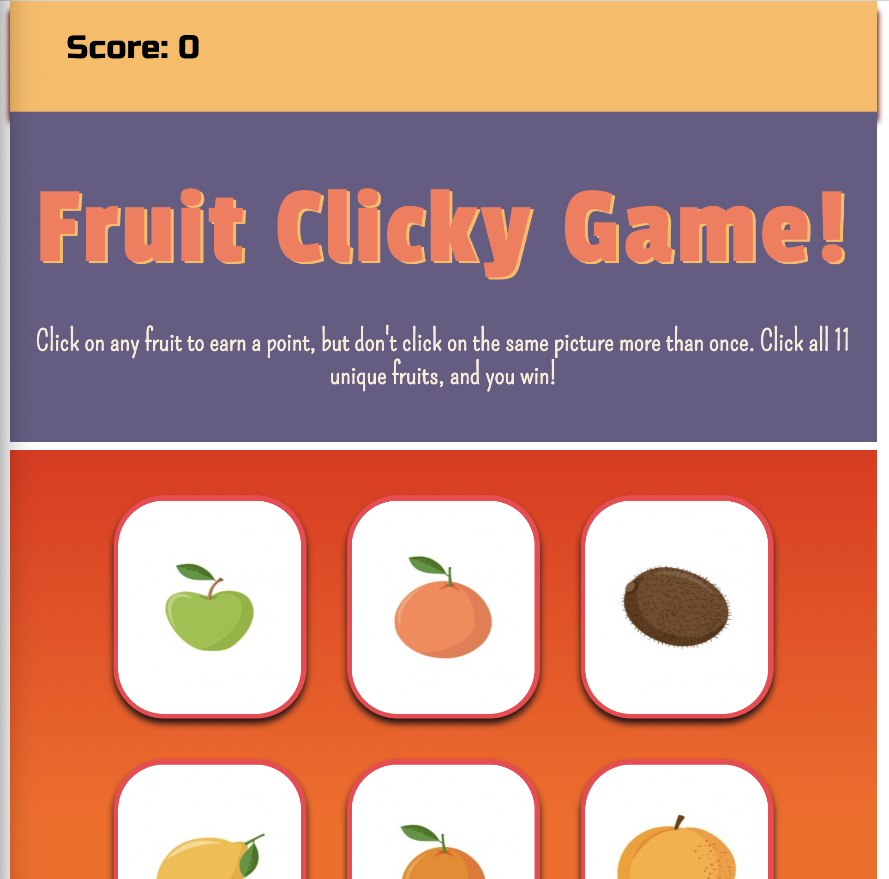

# Fruit Clicky Game

### **Overview**

This project focused on memory as you are shown a bunch of images and challenged to click on a different image every time. Focus and you just might win. Keep trying until you get it right.

- - -

### **Interacting with the Fruit Clicky Game**

- The app will render 11 different fruit images to the screen. Each image listens for click events by the user.



- The app keep's track of the user's score, and increments when clicking an image for the first time. The user's score is then reset to 0 if they click the same image more than once.

- Every time an image is clicked, the images rendered to the page shuffle themselves in a random order.

- Once the user's score is reset after an incorrect guess, the game will restart.

- - -

### **Fruit Clicky Game is created with:**
```
* React
* Bootstrap
* CSS
```
- - -

### **https://ticola.github.io/TheClickyGame/**